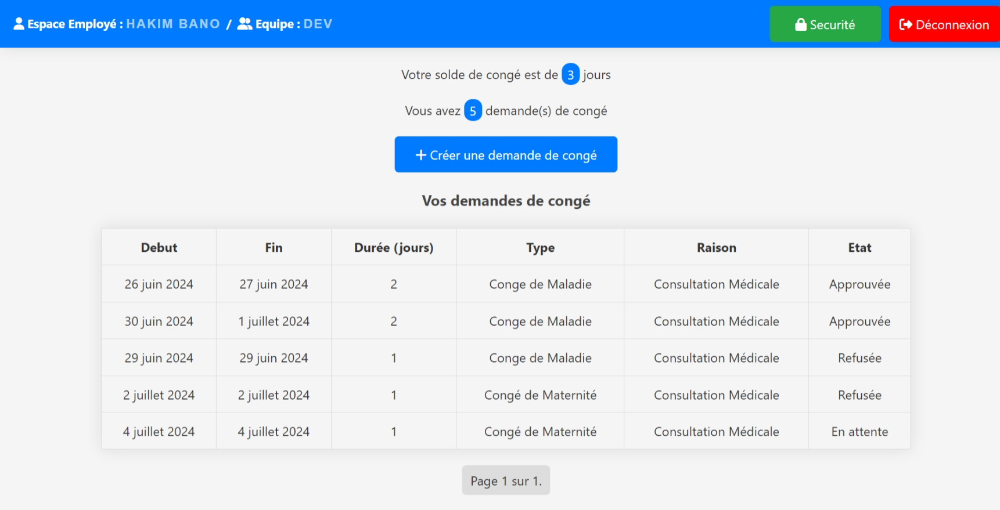
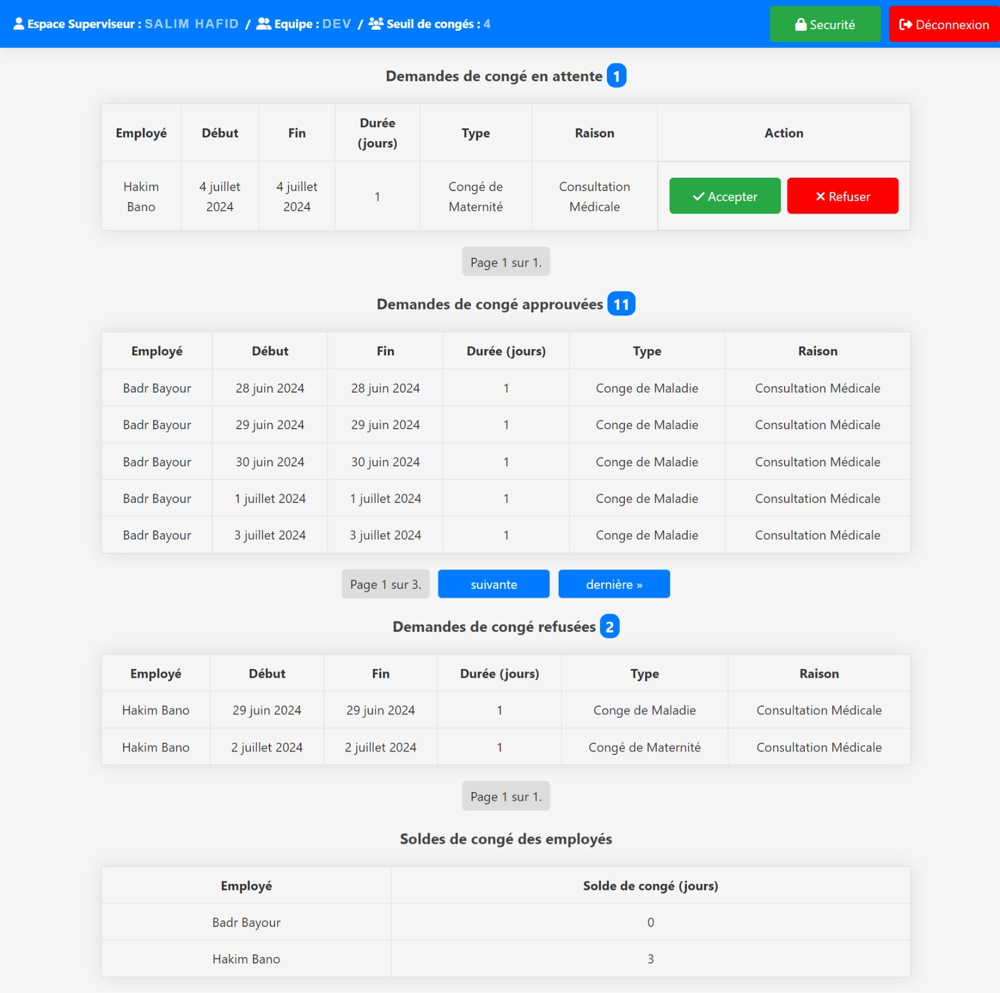
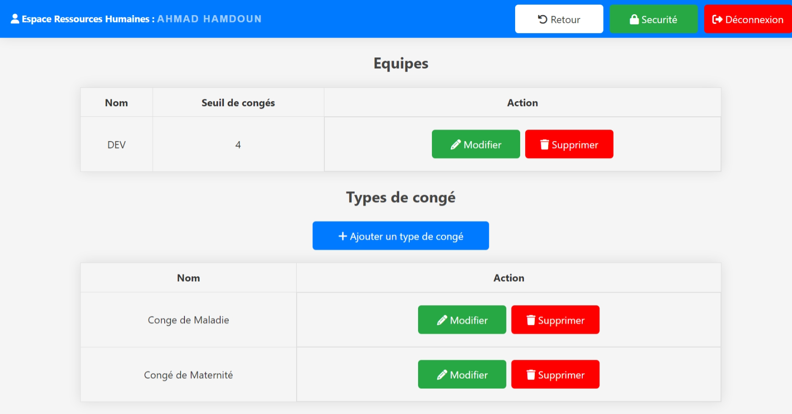

# Projet de Fin d'Année : Application de Gestion de Congés

## Description

Ce projet de fin d'année est une application de gestion de congés. Elle a été conçue pour faciliter le suivi et la gestion des congés des employés dans une entreprise.

## Espace Employé

## Espace Superviseur

## Tableau de bord ressources humaines

## Espace de gestion des paramètres de congés
